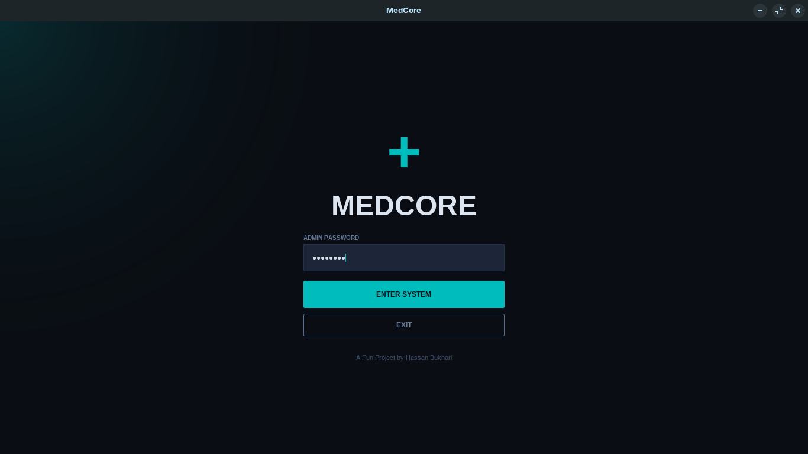
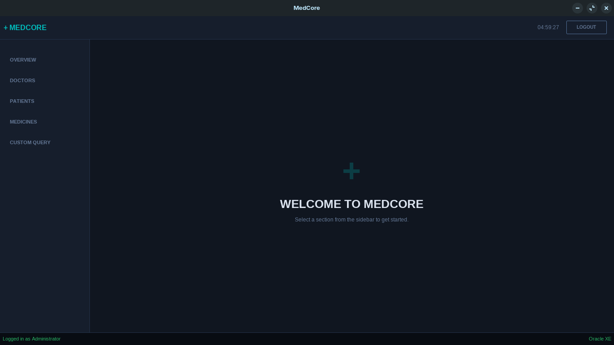
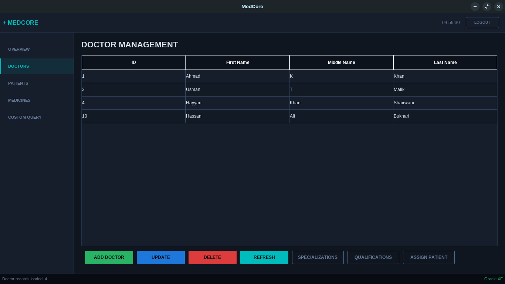
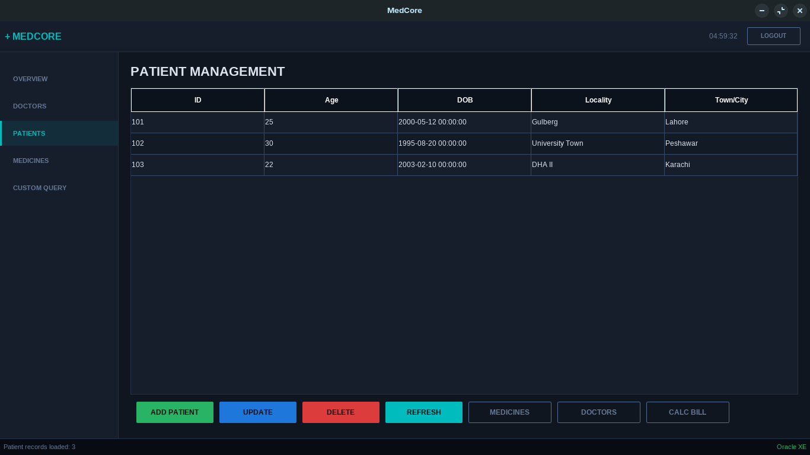
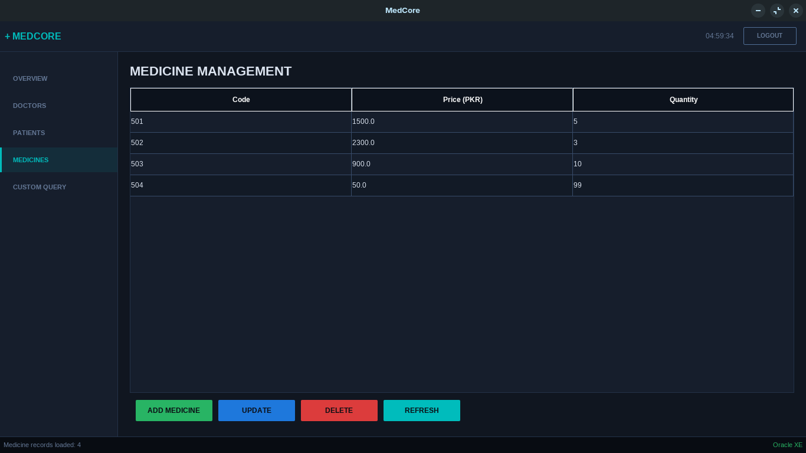
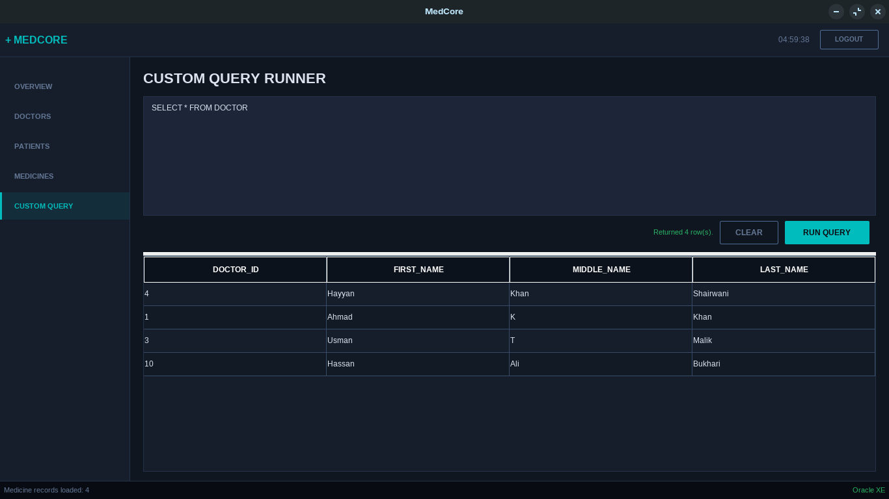

# MedCore Hospital Management System
A Java and Oracle Database based Hospital Management System featuring both Console and GUI implementations.

## Features
### Console Version
- Doctor management
- Patient management
- Medicine management
- Custom SQL query runner
- CRUD operations
- Oracle Database connectivity

### GUI Version
- Modern Java Swing interface
- Doctor records management
- Patient records management
- Medicine records management
- Database integration
- Interactive forms and tables

## Technologies Used
- Java
- Java Swing
- Oracle Database
- JDBC (Oracle ojdbc11)
- SQL
- Bash Shell Scripts

## Project Structure
```text
MedCore-Hospital-Management/
├── src/
│   ├── console/
│   ├── gui/
│   ├── db/
│   └── models/
├── sql/
├── lib/
├── screenshots/
└── run.sh
```

## Requirements
- Java JDK 17 or later
- Oracle Database
- Oracle JDBC Driver (ojdbc11.jar)
- Linux environment or Bash support

## Setup
### 1. Clone Repository
```bash
git clone https://github.com/TheHassanBukhari/MedCore-Hospital-Management.git
cd MedCore-Hospital-Management
```

### 2. Add Oracle JDBC Driver (if not present already)
Place:
```text
ojdbc11.jar
```
inside:
```text
lib/
```

### 3. Configure Database
Run SQL files in order:
```text
sql/create_database.sql
sql/create_tables.sql
sql/sample_data.sql
```

### 4. Run Program (Linux)
```bash
./run.sh
```
For windows make your own Batch File (.bat) from this bash file

## Screenshots

### Login


### Overview


### Doctors


### Patients


### Medicines


### Custom Query


## Author
Syed Hassan Ali Bukhari  
BS Computer Science  
COMSATS University Islamabad
